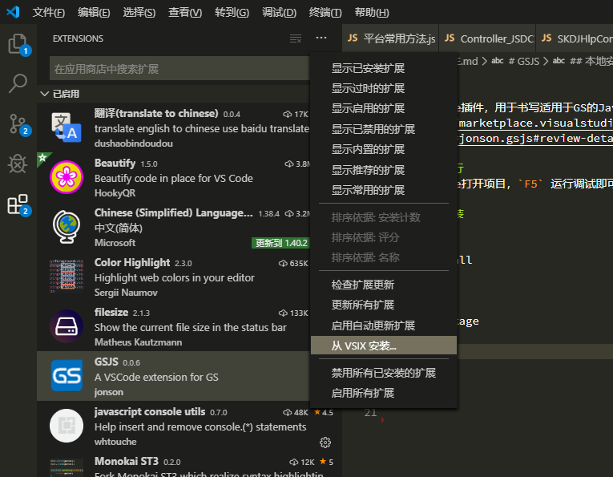

# GSJS

一个VScode插件，用于书写适用于GS的JavaScript代码，已发布在[VSCode应用市场](https://marketplace.visualstudio.com/items?itemName=jonson.gsjs#review-details)

## GitHub

https://github.com/xjonson/vscode-extension-gsjs


## 本地运行

使用VSCode打开项目，`F5` 运行调试即可

## 本地安装

```
npm install
```

```
vsce package
```

选择项目目录下生成的 .vsix 文件




